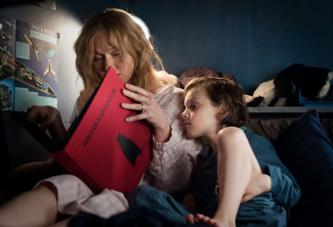

**Essie Davis** je meno austrálskej herečky, ktorá bravúrne stvárnila postovu slečny Fisherovej. Narodila sa 07.01.1970. 
Okrem role slečny Fisherovej ste ju mohli vidieť napríklad v populárnom seriáli *Game of Thrones*, kde stvárnila postavu Lady Crane v šiestej sérii.

Essie „Esther“ Davis má za sebou množstvo filmov a seriálov. V roku 2014 získala niekoľko <a href="https://www.imdb.com/name/nm0204583/awards" target=blank>ocenení</a> v kategórii Najlepšia herečka. Prevažne išlo o jej účinkovanie v austrálskom supernaturálnom psychologickom horore *The Badadook*. Stvárnila tam hlavnú postavu Ameliu Vanek, vdovu so synom, ktorú po prečítaní knihy začne prenasledovať strašidelný Babadook. 

 

<blockquote> „I feel lucky that I've managed to get the roles I've wanted.“ </blockquote> 
