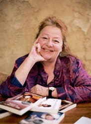

Kerry Greenwood je australská spisovatelka, podle jejíž předlohy byl seriál natočen. Kerry je autorkou mnoha divadelních her a knih, jejím nejvýraznějším počinem jsou ale právě detektivní příběhy s hlavní postavou Phryne Fisher. Píše také science-fiction, historické knihy a povídky pro děti. Kerry se narodila 17. června 1954 v australském Melbourne, kde vystudovala i dvě univerzity a v roce 1979 získala tituly Bachelor of Arts a Bachelor of Laws - během studií pracovala v azylovém domě pro ženy, a než se stala spisovatelkou "na plný úvazek", strávila část svého života prací u soudu, kde pracovala jako obhájce. V roce 1996 vydala knihu esejí o ženských vražedkyních, kterou nazvala "Things She Loves: Why women Kill."
